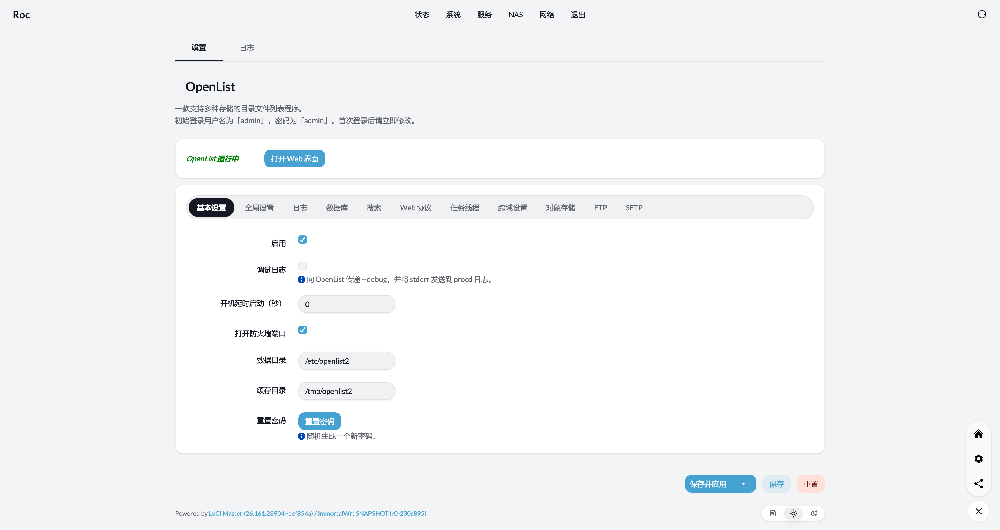

<h1 align="center">OpenWrt OpenList JS 增强版</h1>
<div align="center">

> 官方文档：[用户指南](https://doc.oplist.org/guide) [配置文件](https://doc.oplist.org/configuration/configuration) [反向代理](https://doc.oplist.org/guide/installation/reverse-proxy) [迁移指南](https://doc.oplist.org/guide/migrate) 下载地址：[Packages](https://github.com/laipeng668/openwrt-ci-roc/releases/tag/Packages)

</div>

### 构建方法:

- 安装 `libfuse` 开发包

  - ubuntu/debian:
    ```shell
    sudo apt update
    sudo apt install libfuse-dev
    ```

  - redhat:
    ```shell
    sudo yum install fuse-devel
    ```

  - arch:
    ```shell
    sudo pacman -S fuse2
    ```

- 进入 OpenWrt 源码目录

- OpenWrt 官方快照版本

  *1. 需要 golang 1.26.x 或更新版本（用于修复旧版 OpenWrt 分支的构建问题）*
  ```shell
  rm -rf feeds/packages/lang/golang
  git clone https://github.com/sbwml/packages_lang_golang -b 26.x feeds/packages/lang/golang
  ```

  *2. 获取 luci-app-openlist2 源码并构建*
  ```shell
  git clone https://github.com/laipeng668/luci-app-openlist2 package/openlist
  make menuconfig # 选择 LUCI -> Applications -> luci-app-openlist2
  make package/openlist/luci-app-openlist2/compile V=s # 构建 luci-app-openlist2
  ```

<h2 align="center">页面预览</h2>

